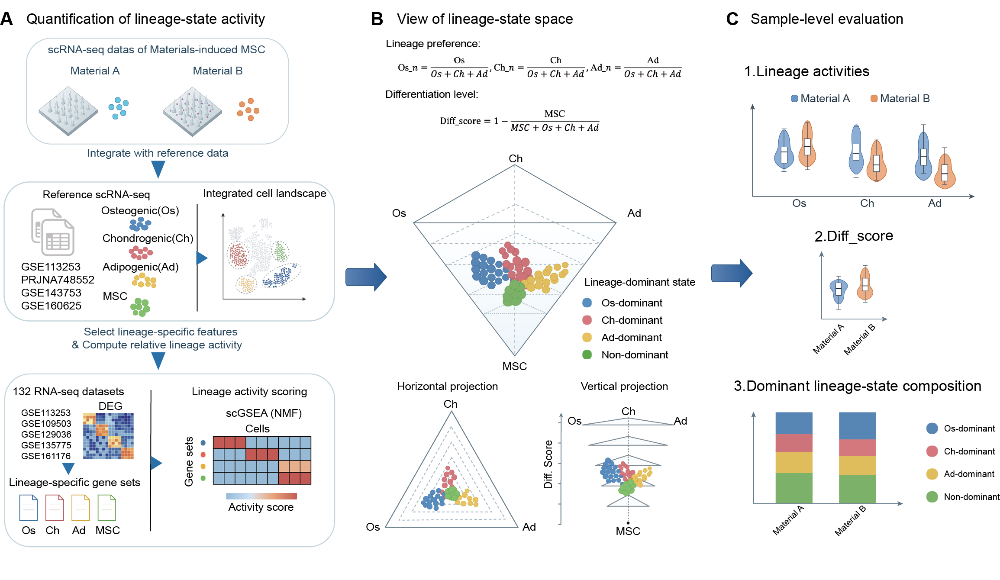

# BioLRAF

**BioLRAF** (**Bio**material-induced **L**ineage **R**emodeling **A**ssessment **F**ramework) is a reference-guided single-cell framework for quantifying and visualizing biomaterial-induced mesenchymal stem cell lineage-state remodeling.

## Quick start

BioLRAF requires a processed single-cell RNA-sequencing expression matrix and matched cell-level metadata.

1. Prepare a cell-by-gene expression matrix and cell metadata.
2. Run [`BioLRAF_analysis.R`](Methods/BioLRAF_analysis.R) to calculate BioLRAF scores.
3. Use [`BioLRAF_visualization_GSE226365.ipynb`](Methods/BioLRAF_visualization_GSE226365.ipynb) as a template for three-dimensional lineage-state visualization.
4. Explore the online results through the [BioLRAF Interactive Explorer](https://pangminmin.github.io/BioLRAF/).

A worked example based on GSE226365 is provided in [`Example/GSE226365`](Example/GSE226365).

## BioLRAF workflow

## Interpretation of the lineage-state space

BioLRAF visualizes each cell in a three-dimensional lineage-state space. The ternary plane represents relative osteogenic, chondrogenic, and adipogenic activities, whereas the vertical axis represents `Diff_score`. Cells can be colored by cell type, experimental group, or dominant lineage state.

## Interactive website and reproducible example

Explore the complete interactive BioLRAF resource:

[Open the BioLRAF Interactive Explorer](https://pangminmin.github.io/BioLRAF/)

Access the reproducible GSE226365 example:

[View the GSE226365 example directory](Example/GSE226365)

## Reproducibility

The example workflow illustrates the expected input format, score-generation procedure, and visualization outputs. Users can adapt the analysis and visualization scripts to their own processed single-cell datasets while retaining the required matrix orientation and matched cell-level metadata.

Please consult [`requirements.txt`](requirements.txt) for Python dependencies and the scripts in [`Methods`](Methods) for the analysis and visualization workflow.

## Citation

If you use BioLRAF, please cite the associated manuscript. Full citation information will be added upon publication.

## Contact

For questions, suggestions, or bug reports, please open an issue in this repository.
